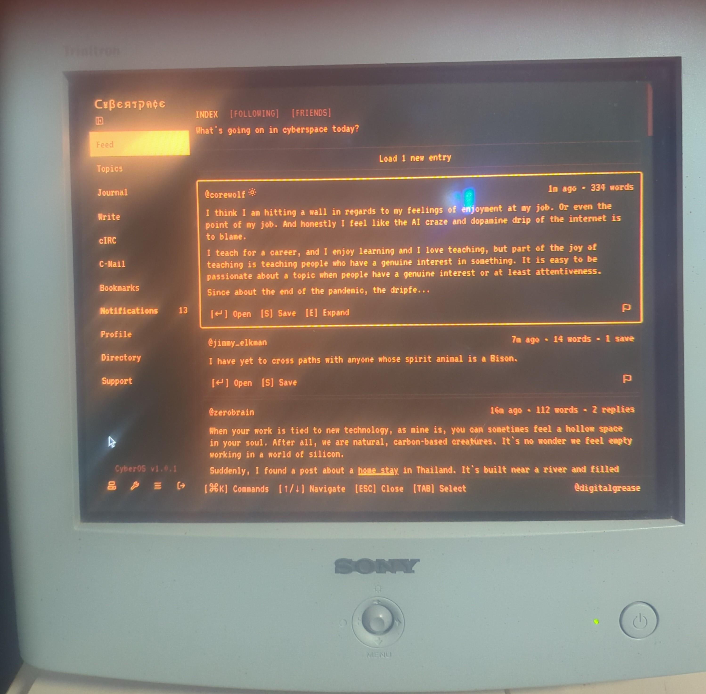

# Phosphor and Static

<figure markdown>
  
  <figcaption>This is an image of <a href="https://cyberspace.online">https://cyberspace.online</a>, on an old CRT monitor.</figcaption>
</figure>

There is a particular quality to the light a CRT throws. Not the clean, flat luminance of an LCD panel—something warmer. Something that breathes. The phosphor in the tube doesn't switch off cleanly; it decays, trailing each frame in a faint ghost of itself before the electron gun sweeps back across. It glows the way a coal glows when the bellows stop. And if you sat close enough, late enough at night, you could feel it on your face.

That warmth is not something you can extract from a spec sheet. No measurement captures it. But those of us who grew up inside it carry the memory somewhere below articulate thought—in the part of the mind that knows the smell of rain before it arrives, or recognizes a voice from across a crowded room.

<!-- more -->

I am not here to make a clinical argument for cathode ray tubes. The technology was bulky, power-hungry, geometrically imperfect, and genuinely terrible for your neck if you craned up at a family set bolted to a bracket in the corner. The point is not the hardware. The point is what surrounded it.

## Living Inside the Change

Those of us who were children in the eighties and nineties had the strange experience of watching the world rewire itself in real time. The pace of change wasn't a statistic we read—it was the texture of daily life. The computer in your classroom at eight years old was a different species than the one at twelve. The internet arrived not as a polished product but as a raw signal full of noise and promise, something that felt like finding a shortwave radio in a drawer and realizing you could hear voices from places you'd never see.

We knew we were watching something happen. That awareness sits oddly in a child's mind—too large to hold, too interesting to ignore. And threaded through all of it was the glow of screens: the television in the living room with its curved glass and its faint electric hum, the monitor in the computer room with its amber or green phosphor text, later the blossoming color of early graphics that seemed, at the time, almost miraculous.

Technology was changing so fast that obsolescence felt exciting rather than exhausting. Each generation of hardware was a door opening onto something new. The upgrade wasn't a chore. It was an event.

## The Culture in the Machine

The nostalgia isn't really for the hardware. Strip it all away and what remains is the culture that formed around it—rituals and communities and a quality of attention that's mostly gone now.

Saturday morning cartoons were a covenant between networks and children, and the television was the altar. You woke before your parents. You arranged yourself on the carpet in the blue pre-dawn light of the screen and the world outside ceased to matter for three hours. The set hummed. The speakers crackled slightly at high volume. It was a shared experience in the most literal sense—the same images flickering in living rooms across a continent, the same commercial jingles embedding themselves in a generation's long-term memory.

LAN parties meant dragging a full tower and CRT monitor across town in the backseat of someone's parents' station wagon. Setup took an hour. The room smelled like Mountain Dew and carpet. You played until you couldn't see straight and then slept on the floor and played again in the morning. Nobody was streaming it. Nobody was clipping highlights. It existed only for the people in that room, and when it ended it passed into memory cleanly, without documentation.

Early internet had edges. It was not smooth. Message boards, IRC channels, personal sites built from raw HTML and hosted on GeoCities with MIDI files that played on load—all of it had the quality of a frontier town, built quickly from whatever materials were at hand, full of eccentric individuals who had self-selected hard into this strange new space. Discovery meant following a link into somewhere genuinely unexpected. The web did not yet know what you were about to click before you did.

There was something in all of this about presence. About being in a place, even a virtual one, with a beginning and an end. Attention had not yet been industrialized.

## What the Glow Kept Hidden

Nostalgia is a selective instrument. It illuminates what we want to remember and leaves the rest in shadow, and that selective quality is exactly what makes it dangerous to take at face value.

The culture that surrounded that technology was not kind to everyone in it. The rooms where computers lived—the computer labs, the LAN parties, the IRC channels—were largely, often aggressively, male. Women who entered those spaces navigated a taxonomy of condescension and exclusion that ran from subtle to explicit. The "who are you" skepticism directed at anyone who didn't fit the assumed profile wasn't incidental to the culture. It was structural.

Access itself was stratification. The families who could afford the hardware, the internet connection, the time to learn the systems—those families had a head start that compounded for decades. The early internet's frontier feeling was real, but the frontier metaphor has always papered over who was already living on the land before the settlers arrived.

The aesthetic of that era carries the fingerprints of its exclusions. When we reach for the visual language of old terminals and scan lines and green-on-black text, we are reaching for something that was coded as belonging to a specific kind of person. Know that when you reach for it.

None of this erases the warmth. But the warmth and the shadow were always the same object, lit from different angles.

## What the Nostalgia Is Actually For

What we are missing when we miss the CRT glow, the dial-up handshake, the feel of a keyboard with real travel: a specific quality of attention.

We were present in those moments not because we were virtuous but because we had no alternative. The machine in front of you was the only machine. The show you were watching was on once a week and then gone. The game you were playing existed on a single disk in a specific room. The conversation you were having in that chat room was happening now, between real people, and if you closed the window it was over.

What has changed is the relationship between technology and time. Attention is now a resource under active management by systems that are very good at their jobs. The feeling of being fully inside something—a story, a game, a conversation, a Saturday morning—has become harder to come by, not because we are weaker but because the competition for that feeling has become professional.

The CRT is not what we want back. What we want back is the experience of uncontested attention. The feeling of being alone with something that mattered, in a room lit by phosphor, with nowhere else to be.

## A Clean Signal in the Noise

I still have a soft spot for the aesthetic. The scan lines. The bloom around bright objects. The way early computer graphics looked like stained glass—bold, flat colors divided by dark borders, each pixel sitting exactly where the artist put it, no anti-aliasing to soften the edges. There is an honesty to it that I find appealing.

But I am not interested in the past as a destination. The things we have built since then—the access, the representation, the tools that let someone in any corner of the world learn and make and connect—those are worth the loss of the frontier feeling. They are what the frontier feeling promised and rarely delivered. We should not mistake the metaphor for the thing.

What I carry forward from the phosphor years is the quality of attention. The willingness to be inside something fully, without reservation. The memory of what it felt like when technology was strange enough to be magic, before familiarity collapsed the distance between wonder and ordinary use.

The CRT is in a landfill somewhere. Good. The glow it threw—the particular warmth of it on your face in a dark room—that belongs to us. We keep what matters and let the rest decay.

Memento mori. Act with purpose. The screen goes dark eventually. Make something worth watching while it's on.
