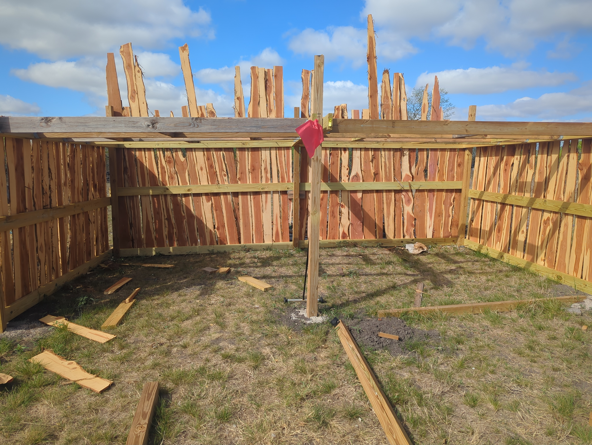
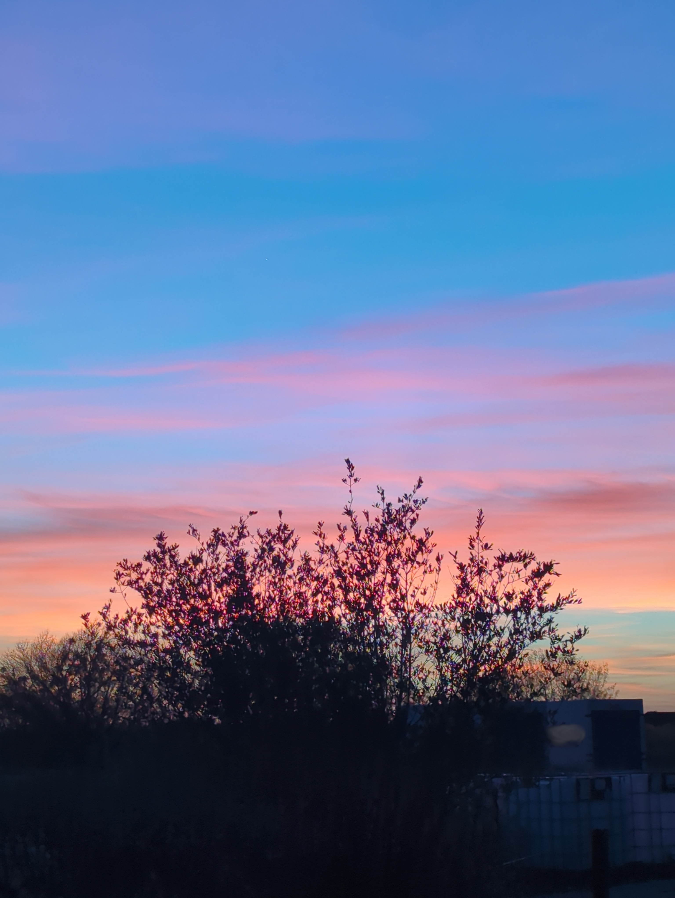

# Signal to Soil

The hammer rings late out here. After the animals are settled and the kid is in bed and the house goes quiet, the forge begins to glow. Steel on steel in the unforgiving heat of Prometheus' flame. Certain nights, I am reminded why we trudge through the human experience.

I grew up in a place like this. Spent my adolescence aching to leave and grow and change. Took me more than a decade to understand that the thing I was running from and the thing I was looking for were the same place, removed only by time and perspective.

<!-- more -->

---

## A Disconnected Kid, with an Internet Connection

Rural internet in the early 2000s was a particular kind of torture. Dial-up, maybe DSL or even cable once things really got going with infrastructure. We were not lucky most of my childhood. For a physically and economically rural kid already obsessed with computers, it felt like being handed a map of a library you could only enter for forty minutes at a time, and only after nine PM when the rates dropped. (Seriously, the gods blessed us with the migration from dial up to cable in the early 2000's)

What that did to me, predictably, was make me learn to be resourceful. And resourceful, at fifteen, with no mentors, too much time and a copy of Backtrack 3 (there's a throwback, look it up kids) burned onto a DVD, meant getting into trouble. Nothing serious in retrospect, script kiddie stuff, the usual adolescent misuse of tools I only half understood. But it felt serious at the time. It felt like power. It felt like a window out.

When you grow up somewhere that feels small, The internet isn't just the internet. It's a way out. Every packet I sent out over that line was me reaching for something I couldn't name yet.

The irony is that the skills I was building, badly and sideways and without any real guidance, were the ones that eventually got me out. Information Security, though they'd later change the buzzword to Cybersecurity. A career in tech that took me, and my son, to the first of our big cities.

I became a father in my teens. By my early twenties I was a single dad with a kid in tow, moving toward something that felt like opportunity and away from everything familiar. A particular kind of aching to leave. Not just restlessness. Stakes.

---

## A Tale of Two Cities

I don't remember the exact moment I decided I was finally leaving my hometown. I remember the circumstances; I was a mechanic working 60+ hours a week and not making enough to support us on my own. I knew we had to leave, or we'd both be stuck there forever.

What I was chasing is harder to articulate now than it felt then. Something about density. About being somewhere things could actually happen, where things could change. About distance from the place that made me feel like I was going nowhere.

There's an odd, almost melancholy loneliness that comes with that kind of running. You're surrounded by people. Being in tech means you're gainfully employed, and often making good money (obscenely good by my childhood standards but that's a different article). You have every urban amenity you spent your childhood wanting. And there's still something, some background hum, that doesn't resolve.

I told myself it was the wrong city. Or the wrong job. Or I just needed to travel more, build more, learn more. The explanations kept shifting because the feeling didn't go away. That's the thing about the grass is always greener on the other side, it doesn't announce itself. You don't realize you're living it while you're living it. You just keep moving toward the green part.

---

## The Return

Two years ago, my partner (ironically a city girl) and I moved back to rural land.

I can't point to a single thing that tipped it. It was more of an accumulation, kids getting older, priorities shifting, a growing sense that what we were building needed roots, not square footage. The city felt increasingly like a stage set (all the world is a stage after all). Beautiful in its way. Expensive. Loud. And somehow less real than the question of whether we'd get the garden in before the last frost.

When we arrived, I noticed the silence. Not actual silence, but the absence of a specific kind of noise. The ambient pressure of density. The static, white noise hum of cities that resonates with an old TV tuned to the wrong channel. The low-grade vigilance that city living requires. It lifted.

It's funny, I've noticed this trend among technical professionals, this gravitation towards nature. As if at some point, you become saturated with the feeling of consuming and operating technology, 

The animals came first, chickens, then ducks. Sheep and rabbits are next. The enclosure in that photo is already going up, cedar-paneled, waiting. There's something grounding about building a thing before the thing that needs it exists. You're committing to a future that hasn't arrived yet, which is somehow less terrifying than dealing with the present day.

---

## What We're Building

Self-sufficiency isn't an ideology here. It's a practical project. We're not trying to disappear from the grid or make some statement. We're just trying to reduce dependency where we can, learn skills that mean something, and feed our family with food we understand.

We're digging a Walipini, an earth-sheltered greenhouse, a technique developed in the Andes for year-round growing in cold climates. The hole in the photo above is the beginning of something. You dig down below the frost line, use the thermal mass of the earth to regulate temperature, and angle a transparent roof to capture winter sun. Passive solar architecture. Old knowledge. Doesn't need a subscription.

The blacksmithing was never an accident. I wanted to be a blacksmith when I was small, the kind of kid who thought that was a real job you could still have, and never quite let go of it. I got a taste of metalworking as a teenager when I learned to weld. That was enough to know the feeling was real. But the forge itself, the hammer, the fire, that took decades and a change of landscape. Moving out here finally gave me the means to start. It's everything I thought it would be, and then some. Hot metal and code are more alike than people think. Both do exactly what you tell them, not what you mean. Both will expose a gap in your understanding immediately and without sympathy. You can get good at either, but you can't talk your way past either. The forge doesn't care about your intentions any more than the compiler does.

Both the air and my soul simultaneously feel cleaner out here. The sleep feels different too. Something that had been tight in my chest for years started loosening around month three, and I didn't even notice until it was gone.

---

## Not a Lesson

This is not a case for rural living. It's not an argument that cities are bad, or that tech work hollows you out, or that everyone should go find some acreage and raise sheep. People I respect deeply have built lives in cities that feel whole and real and like exactly the right place for them. The city didn't fail me. I was looking for something it couldn't give, and that's not the city's fault.

What changed between the kid who was aching to leave and the adult who came back was perspective and maturity. The slow accumulation of enough experience to stop confusing the place with the feeling. The teenager who left had to leave. The adult who came back got to choose.

Everyone has their own journey, their own road. Mine happened to be a circle is all.
